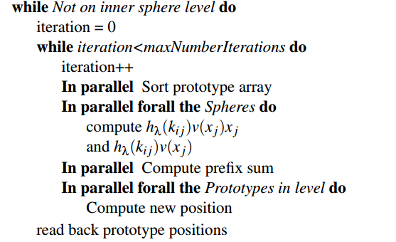
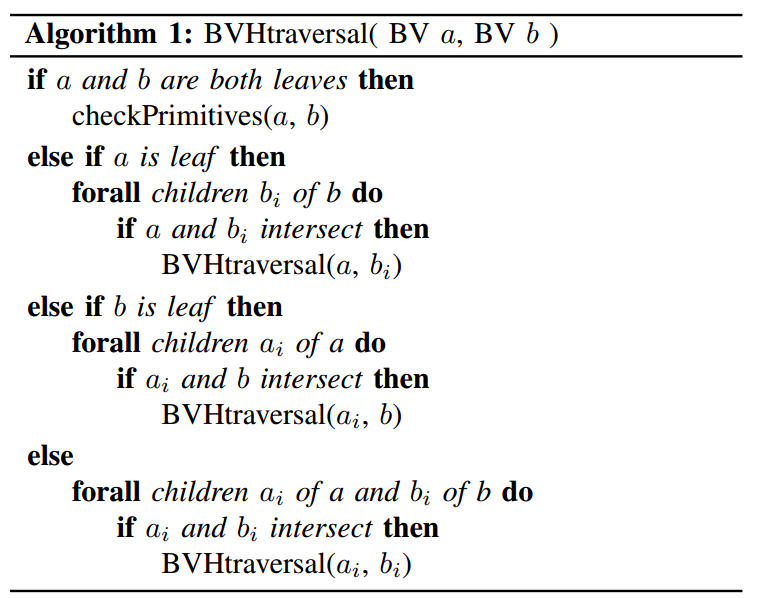

### SIMD accelerated BVH

[Basic Bounding Value Heirarchy read](https://pbr-book.org/3ed-2018/Primitives_and_Intersection_Acceleration/Bounding_Volume_Hierarchies)

[SIMD Intrinsics](https://www.intel.com/content/www/us/en/docs/intrinsics-guide/index.html)

SIMDop algorithm:

- Create a BVH from set of polygonal shapes
  - Top down breaking of the C-space
  - Wrapped hierarchy for BV struct.
  - Splitting criterion: [Batch Neural Clustering](https://davidmainzer.com/papers/2014_vriphys_paper.pdf)
    - Use center of polygons to cluster the C-space polygons.
    - [Batch Neural Clustering]() algorithm:
      - initialise points $\mathbb{R}^m$ and prototypes $\mathbb{R}^n$ 
      - $\epsilon$ = 1e-5 x BoundingBoxSize
      - while (movement of prototypes < $\epsilon$)
        - Sort the protypes using a Rank matrix which is populated for every prototype with every point. $k_{ij} = |{w_k : d(x_j, w_k) < d(x_j, w_i)}| \in {0, n}$
        - Compute new positions for the prototypes $w_i := \frac{\sum_{j=0}^{m} h_{\lambda}(k_{ij})x_j}{\sum_{j=0}^{m} h_{\lambda}(k_{ij})}$
      - Here $h_{\lambda}(k) > 0$ and it's a monotonically decreasing function($e^\frac{k}{\lambda}$) where $\lambda_{0} = \frac{n}{2}$ and reduction $\lambda(t) = \lambda_{0}(\frac{0.01}{\lambda_0})^\frac{t}{t_{max}}$.
  - SIMD Implementation: 
<p align="center">
  
</p>

- Traverse BVH:
  - Intersection Algorithm: 

```cpp
_mm512 endResult
for (auto i = 0; i != k/2; i++){
    _mm512 oriAL = _mm512_set1_ps(a[i]); //Sets elements to equal specified single-precision floating point value. There is no corresponding instruction. This intrinsic only applies to Intel® Many Integrated Core Architecture (Intel® MIC Architecture).
    _mm512 oriBL = _mm512_set_ps(b1[i], ..., b16[i]); // Sets packed float32 elements in destination with supplied values.

    _mm512 resL  = _mm512_cmp_ps(oriAL, oriBL, _CMP_LT_OS); // Comparison instruction for AVX 512

    _mm512 oriAH = _mm512_set1_ps(a[k/2 + i]);
    _mm512 oriBH = _mm512_set_ps(b1[k/2 + i], ..., b16[k/2 + i]);
    _mm512 resH  = _mm512_cmp_ps(oriAH, oriBH, _CMP_GT_OS);
    _mm512 tempRes = _mm512_kor(resL, resH); // Compute the bitwise OR of 16-bit masks a and b, and store the result in k.
    endResult    = _mm512_kor(endResult, tempRes);
    if(endResult == 65535){
        break;
    }
}
return endResult;
```

  - Overall Algorithm:
  <p align="center">
    
  </p>
